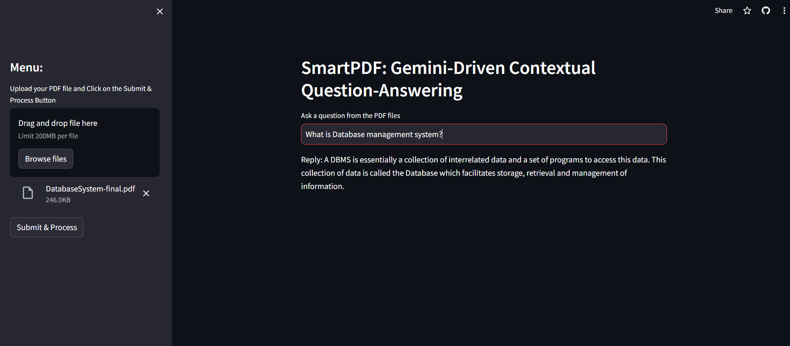
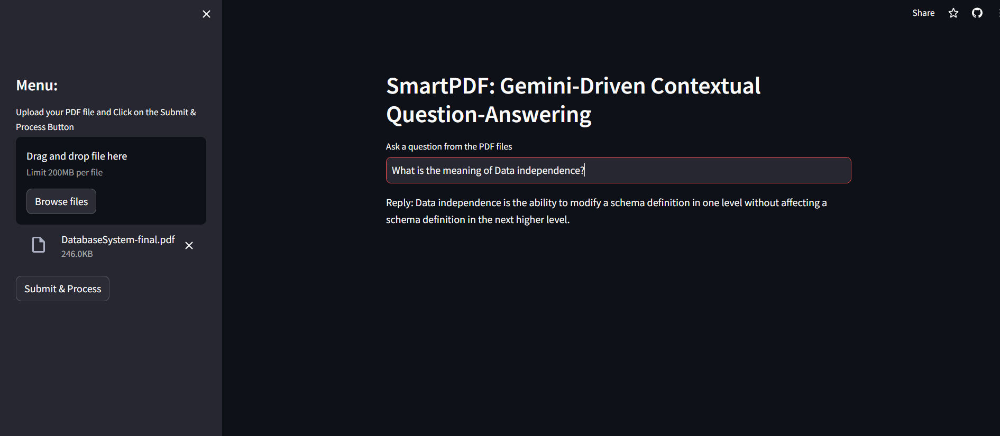
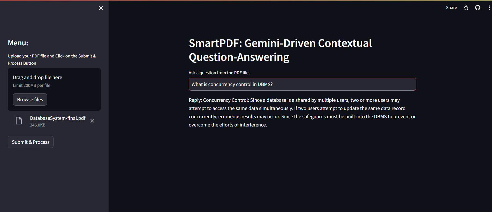
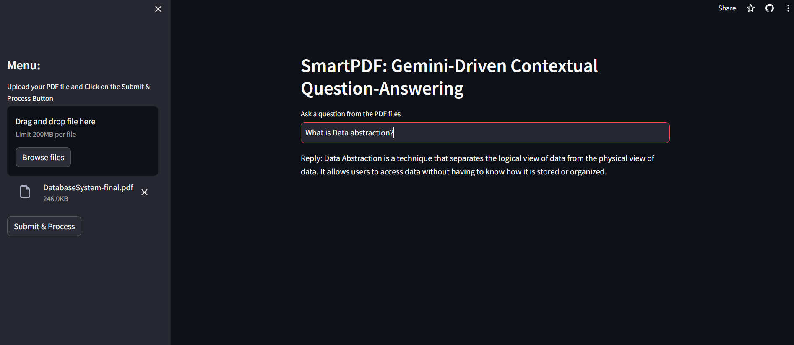
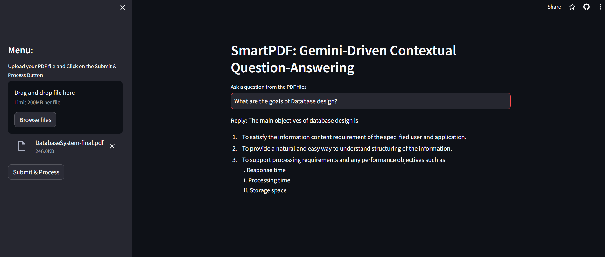
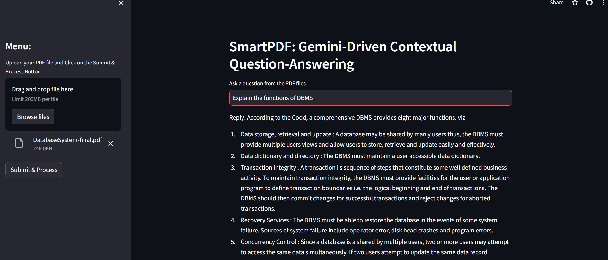

# PDF-Contextual-Query-Solver
System which takes PDF and we have to ask question based on the context of that PDF. System will provide the answer of the question.

### Key Features:

* Upload and process PDF documents seamlessly.
* Natural language querying for contextual information retrieval.
* Advanced natural language processing capabilities powered by Gemini AI.
* Intuitive interface for easy interaction and navigation.
* Quick and accurate responses to user queries, enhancing productivity and decision-making.

